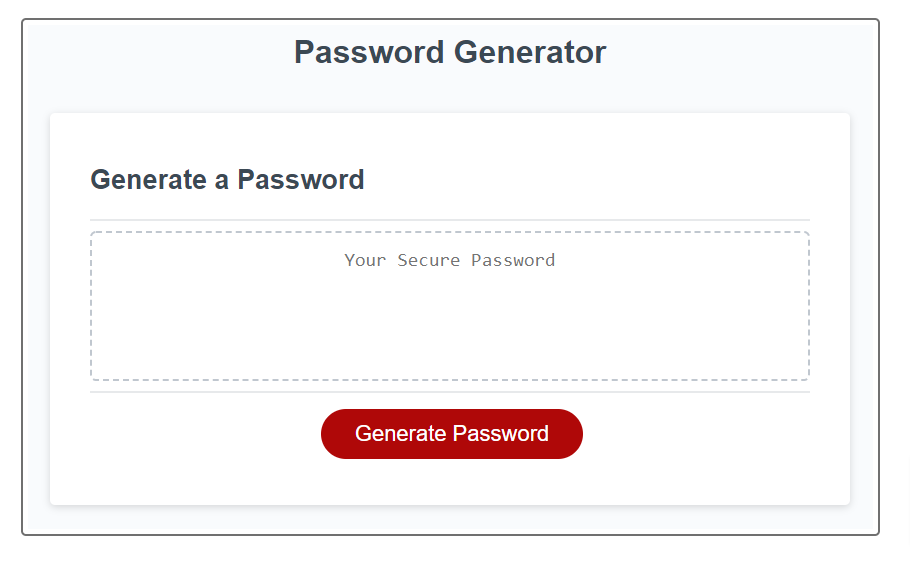

# password-generator

## Discription

This application is used to generate random password bettween 10 and 64 characters. You can chose the following types of characters:

+ Lowercase letters
+ Uppercase letters
+ Special characters
+ Numbers

## Screenshot

  

## Link to live version

https://niksimeonov.github.io/password-generator/

## Project is created with:

HTML5, CSS3, JavaScript

## Installation

N/A

## Usage

Personal use

## Credits

N/A

## License

MiT Licence